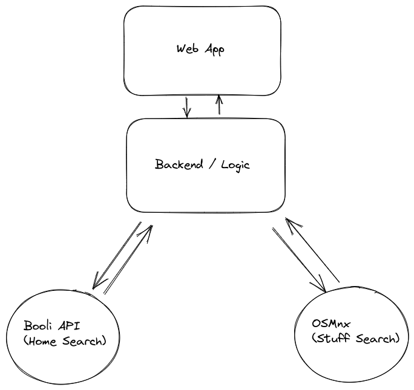

# house-search
A house searching app written in Python (Innovation Day 2023)



## Requirements

1. Filter by criterias
    - beach, restaurants, food-store, bus-stop/train
2. Show-case listings within a area

### Extra Scope

1. Average salary in area
2. Natural Language Query (ChatGPT -> structured query)
3. Selling Description (e.g. Wiki+ChatGPT)

### Super Future Scope

1. Calculate Room Sizes based on total sqm & "planritning"

## How to divide work

1. Frontend -- Pause
2. (Optional) Requirements / Improvements / Flow -- Erik
3. OSM Integration -- 
4. Booli integration -- 
5. Backend Core -- 
6. Tests -- 

## Installation

```bash
curl micro.mamba.pm/install.sh | bash # alternatively https://mamba.readthedocs.io/en/latest/installation.html

micromamba create -f env.yml
micromamba shell init --shell=bash --prefix=~/micromamba

# Start a new shell
micromamba activate hemnet
```

## OSM Possibilities

There's a few ways to parse OSM data, both simpler and harder. I propose two different ways.

### 1. OSMnx
This API allows using a Web API which means nothing is kept local except what we query. There's network delay but it has a lot of possibilities.

### 2. Pyrosm
This API allows querying a local `.osm.pbf` file which means it's _really fast_ and doesn't require network.  
Albeit it is less configurable and requires more setup!

Sweden's latest `.osm.pbf` file is available at [download.geofabrik.de/europe/sweden-latest.osm.pbf](https://download.geofabrik.de/europe/sweden-latest.osm.pbf).

## Home Search API:s

I found two ways to accomplish a way to find available homes:

### 1. Hemnet (Scraping)
Scraping is ugly and regarded as bad practice, sometimes not even legal.  
Hemnet's API is only built for brokers and is not able to list listings. Hence scraping is required.

I started building a scraper which I scrapped when I found the second solution.

### 2. Booli API
Booli, another home search tool, has a real API which means we can much much simpler query in a (fully) legal way!

It becomes more efficient and nicer all round.

## Web App

I see multiple ways we can implement this. 

### 1. Streamlit
Simple as is.  
Hard to test. We need a tool like "cypress" to test the frontend. No backend available.

### 2. FastAPI
Pretty simple too, perhaps an uglier frontend though. We can use some nice CSS styling to keep it decent.  
Easier to test.

### 3. Streamlit + FastAPI
We use FastAPI as a backend and streamlit as a frontend. This decoupling makes the backend testable in separation.

### 4. FastAPI + (React / Svelte / ...)
Slower development. Better.

### 5. GIF


[house_search.mp4](https://github.com/londogard/house-search/assets/7490199/9cf83ce5-fe68-40aa-ae2c-0354874a1805)


Simple as is.  
